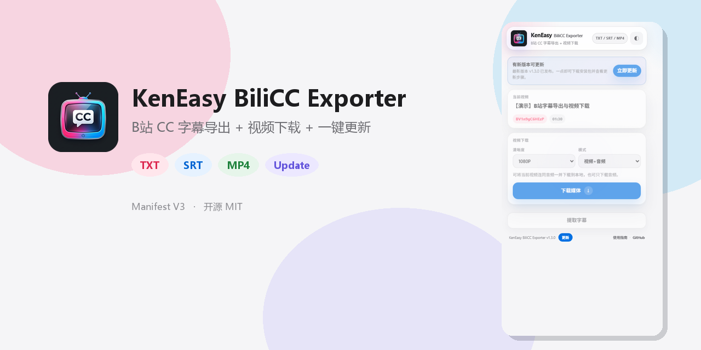
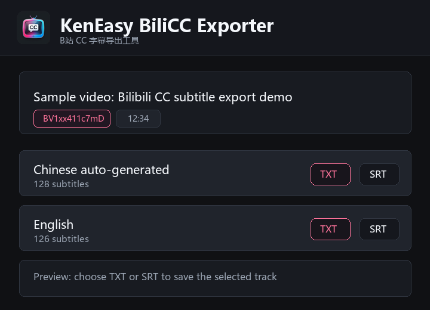
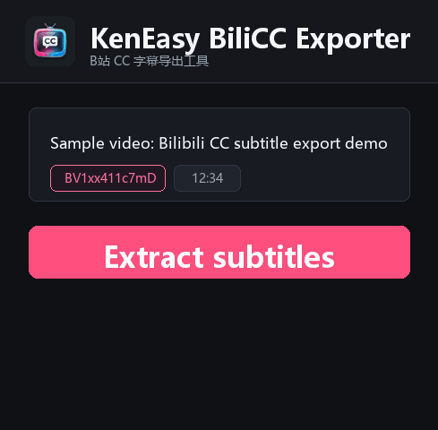

<div align="center">
  

  <h1>KenEasy BiliCC Exporter</h1>

  <p>
    Export Bilibili CC subtitles from the current video page as <code>TXT</code> or <code>SRT</code>, and download video/audio locally.
  </p>

  <p>
    <a href="README.zh-CN.md">中文</a>
    ·
    English
    ·
    <a href="CHANGELOG.md">Changelog</a>
  </p>

  <p>
    <a href="https://chromewebstore.google.com/detail/keneasy-bilicc-exporter/nifdbandikjjmgkagghonjjckmpccgng"></a>
    
    
    
  </p>
</div>

## 🚀 Installation

### Option 1: Chrome Web Store (Recommended)

Install directly with one click from the official store for automatic updates without manual file extraction:

👉 **[Get KenEasy BiliCC Exporter on Chrome Web Store](https://chromewebstore.google.com/detail/keneasy-bilicc-exporter/nifdbandikjjmgkagghonjjckmpccgng)**

### Option 2: Manual Installation (Developer Mode)

If you cannot access the Chrome Web Store:

1. Download `KenEasy-BiliCC-Exporter-manual-install.zip` from the [Latest Release](https://github.com/ngiken/KenEasy-BiliCC-Exporter/releases/latest).
2. Extract the zip file.
3. Open `chrome://extensions/` in Chrome.
4. Enable **Developer mode** in the top right.
5. Click **Load unpacked**.
6. Select the extracted `KenEasy-BiliCC-Exporter` folder.
7. Open a Bilibili video URL (`https://www.bilibili.com/video/BV...`), then click the KenEasy BiliCC Exporter icon.

## Overview

KenEasy BiliCC Exporter is a lightweight Chrome extension for Bilibili video pages. It detects the active `BV` video, finds available CC subtitle tracks, and saves them as plain text or standard SRT files.



## Highlights

| Capability | Details |
| --- | --- |
| Bilibili page detection | Reads the active video page and resolves `BV`, `aid`, and `cid`. |
| Subtitle discovery | Uses page-observed subtitle data first, then falls back to Bilibili web APIs. |
| Export formats | Saves subtitle tracks as `TXT` or `SRT` with UTF-8 BOM for Windows compatibility. |
| Video / audio download | Saves the current Bilibili video with audio (or audio-only) to your computer |
| One-click update | Checks GitHub Releases and downloads the latest package for reload |
| Store-ready footprint | Keeps the extension dependency-free and small for Chrome Web Store packaging. |

## Built-in Help & About

Use the **Help & guide** link at the bottom of the popup to open the extension's built-in help page. It includes:

- A three-step subtitle export guide
- Annotated popup screenshots
- A complete animated usage demo
- Chrome Developer mode installation steps
- TXT / SRT format guidance and common questions

The help page uses only packaged local assets, supports Chinese and English, and follows the same light/dark appearance setting as the popup.

## Demo / Usage Intro

Watch the latest usage walkthrough for the current popup UI, including subtitle export, media download, and update entry points:

**[Usage intro video (UseDemo.mp4)](UseDemo.mp4)**



The short GIF above is a quick preview. Open UseDemo.mp4 for the full screen recording of the real extension workflow.

## Package

Zip the contents of the `chrome-extension` folder, not the parent folder:

```bash
python scratch/zip_extension.py
```

Privacy policy: [PRIVACY.md](PRIVACY.md)

Store publish checklist: [docs/CHROME_WEB_STORE.md](docs/CHROME_WEB_STORE.md)

## Architecture

The extension is intentionally layered, decoupled, rule-based, and data-driven.

```text
brand-config.js
  Shared product naming, message namespaces, log prefixes, and storage prefixes.

content-main.js
  Runs in the page world, observes Bilibili player/subtitle responses, and performs same-page fetches.

content.js
  Runs in the isolated extension world, bridges popup/background messages, and caches subtitle hints.

background.js
  Owns Bilibili API calls, WBI signing, subtitle JSON loading, and error normalization.

popup.js
  Owns UI state, cache preference, TXT/SRT conversion, preview, downloads, and update actions.

update-config.js / update-service.js
  Data-driven GitHub release checks and package download strategies.
```

## Friends / 友情链接

- [LINUX DO](https://linux.do)

## License

MIT
