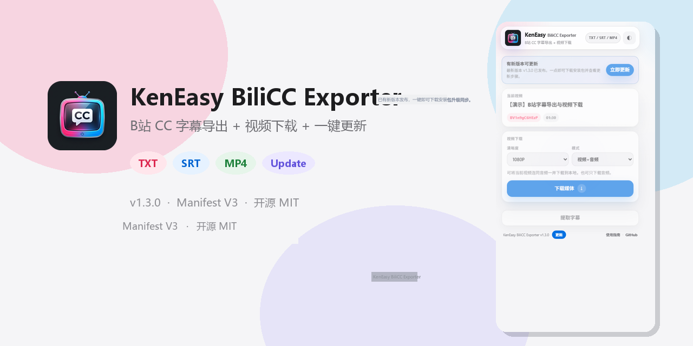
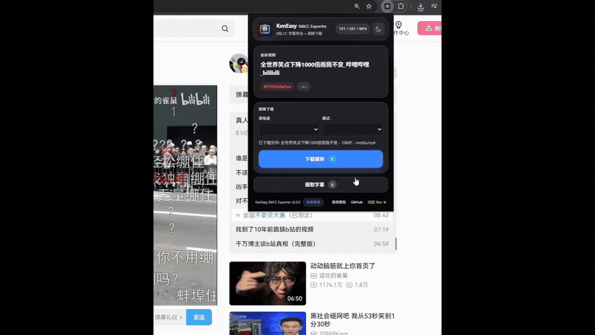
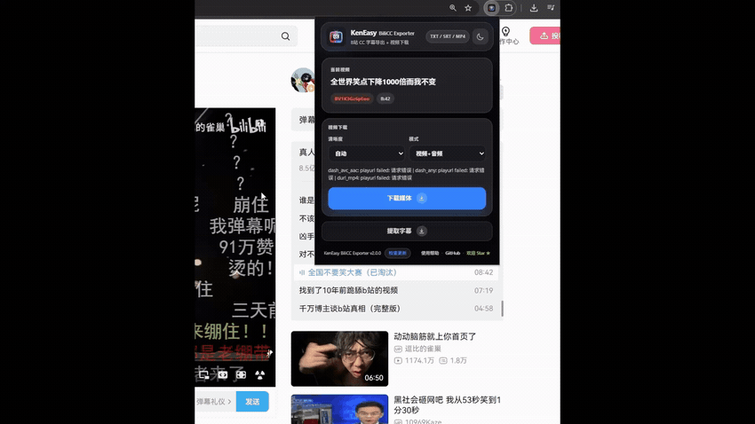
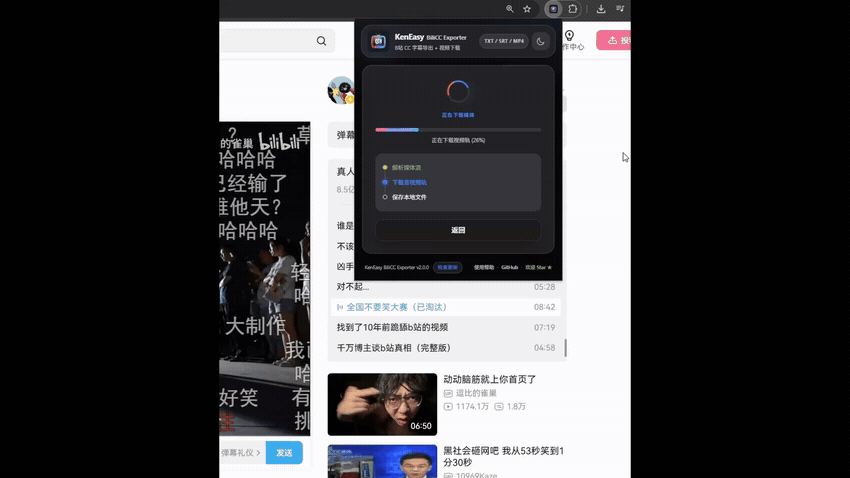

<div align="center">
  

  <h1>KenEasy BiliCC Exporter</h1>

  <p>
    从 Bilibili / B站当前视频页读取 CC 字幕并导出为 <code>TXT</code> / <code>SRT</code> / <code>VTT</code> / <code>JSON</code>，支持一键复制字幕全文，支持高清音视频下载与后台常态化断点状态恢复。
  </p>

  <p>
    中文
    ·
    <a href="README.md">English</a>
    ·
    <a href="CHANGELOG.md">更新记录</a>
  </p>

  <p>
    <a href="https://chromewebstore.google.com/detail/keneasy-bilicc-exporter/nifdbandikjjmgkagghonjjckmpccgng?hl=zh-CN"></a>
    
    
  </p>
</div>

## 🚀 安装方式

### 方式一：Chrome 官方应用商店安装（推荐）

通过 Chrome Web Store 官方商店一键点击安装，后续支持自动静默更新，体验最省心（无需手动下载解压）：

👉 **[前往 Chrome Web Store 官方商店安装 KenEasy BiliCC Exporter](https://chromewebstore.google.com/detail/keneasy-bilicc-exporter/nifdbandikjjmgkagghonjjckmpccgng?hl=zh-CN)**

### 方式二：本地开发者模式手动安装

若无法直接访问 Chrome 应用商店，可选择离线手动安装：

1. 到 [最新 Release 页面](https://github.com/ngiken/KenEasy-BiliCC-Exporter/releases/latest) 下载 `KenEasy-BiliCC-Exporter-manual-install.zip`。
2. 解压下载的 zip 文件。
3. 在 Chrome 浏览器地址栏打开 `chrome://extensions/`。
4. 开启右上角的「开发者模式」。
5. 点击左上角的「加载已解压的扩展程序」。
6. 选择解压出来的 `KenEasy-BiliCC-Exporter` 文件夹。
7. 打开任意 Bilibili 视频页面（如 `https://www.bilibili.com/video/BV...`）即可开始使用。

## 🎬 核心功能实操演示（动态循环）

无需下载，直接查看 3 大核心功能的动态实操演示（自动循环播放）：

### 1. CC 字幕提取与导出全流程
> 自动识别当前 B 站视频的所有 CC 字幕轨道，支持实时预览并导出为兼容性良好的 `TXT` 或 `SRT` 文件。

<div align="center">
  
</div>

### 2. 高清音视频媒体下载与本地合流
> 支持自定义分辨率（1080P、720P 等）与下载模式（音视频合流、纯音频、纯视频），零外部依赖在浏览器端完成 MP4 合并。

<div align="center">
  
</div>

### 3. 后台常态化下载与随开随走断点恢复
> 任务全程由后台 Service Worker 托管，下载中途随意关闭或切换弹窗绝不中断，重新打开即刻无缝恢复最新进度。

<div align="center">
  
</div>

## 核心能力

| 能力 | 说明 |
| --- | --- |
| B站视频识别 | 自动读取当前视频页，并解析 `BV`、`aid`、`cid`。 |
| 字幕轨道发现 | 优先使用页面已加载的字幕数据，失败时回退到 Bilibili Web API。 |
| 多格式字幕导出 | 支持保存 `TXT`、`SRT`、`VTT` 或结构化 `JSON`，并使用 UTF-8 BOM 兼容各端工具。 |
| 一键复制字幕全文 | 点击即刻复制文本到系统剪贴板，伴随敏捷微动效反馈（`已复制✓`）。 |
| 实时下载监控看板 | 实时显示下载速率（MB/s）、已传/总大小（MB）、动态平滑 ETA 预计剩余时间，彻底告别等待焦虑。 |
| 平滑流式传输引擎 | 自适应渐近进度推演算法，无 Content-Length 头也平滑前进，根治卡在 18% 假死问题。 |
| 五阶透明处理流水线 | 状态清晰透明（流解析 → 视频流高速下载 → 音频流拉取 → 本地无损 MP4 混流 → 本地落盘）。 |
| 后台安心托管与桌面通知 | 明确后台无忧提示，关闭弹窗不中断；下载完成后主动弹出 Chrome 桌面系统通知。 |
| 随时主动取消掌控 | 提供「取消下载」按钮，底层 AbortController 毫秒级中断，即刻释放内存与网络带宽。 |
| 10 次使用里程碑致谢 | 成功使用 10 次后弹出温馨弹窗，支持一键前往 GitHub 点赞 Star 或稍后再说。 |
| 智能更新解耦 | 商店用户享受 Chrome 官方静默自动升级；离线开发者用户享受 GitHub Release 检查。 |

## 扩展内帮助与关于

弹窗底部的「使用帮助」会打开扩展内置的帮助页面。该页面包含：

- 三步字幕导出教程
- 弹窗位置说明与实际截图
- 完整动态操作演示
- Chrome 开发者模式安装步骤
- TXT / SRT 格式说明与常见问题

帮助页面使用扩展内的本地资源，无需额外网络请求，并支持中英文和深浅色外观。

## 打包

打包时要压缩 `chrome-extension` 文件夹里面的内容，不要把外层文件夹一起压进去。

```bash
python scratch/zip_extension.py
```

隐私政策：[PRIVACY.md](PRIVACY.md)

商店发布检查清单：[docs/CHROME_WEB_STORE.md](docs/CHROME_WEB_STORE.md)

## 架构说明

扩展采用分层设计，解耦清晰，规则与数据驱动。

```text
brand-config.js
  统一的产品命名、消息命名空间、日志前缀与本地存储键名。

content-main.js
  运行在页面主上下文（Page World），监听 B站播放器和字幕请求，支持同源请求。

content.js
  运行在扩展隔离上下文（Isolated World），桥接弹窗/后台消息，并缓存字幕线索。

background.js
  负责 B站 API 调度、WBI 签名、字幕 JSON 加载与错误标准化。

popup.js
  负责 UI 状态、缓存偏好、TXT/SRT 转换、预览、下载以及检查更新逻辑。

update-config.js / update-service.js
  数据驱动的 GitHub Release 版本检查与更新包下载策略。
```

## 友情链接

- [LINUX DO](https://linux.do)

## 开源协议

MIT
